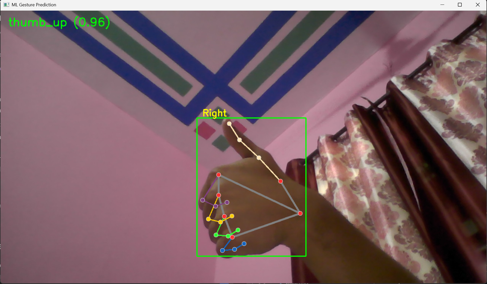
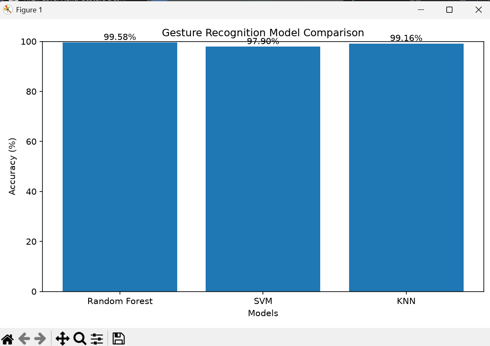
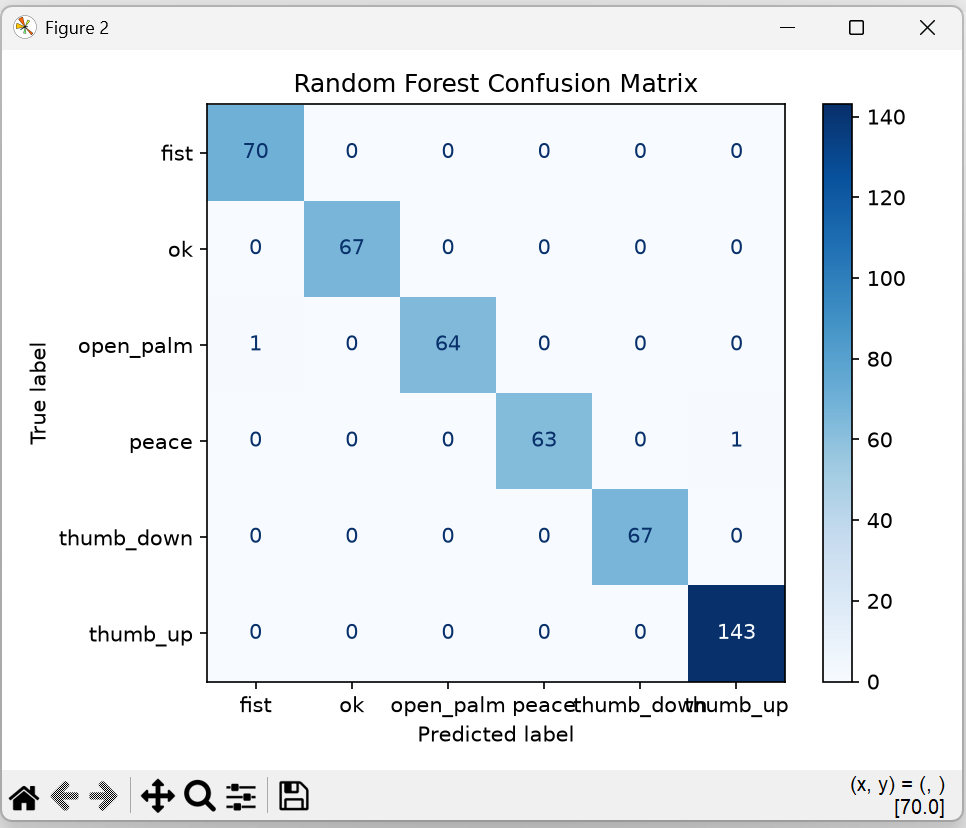

<p align="center">


</p>

<h1 align="center">🤖 AI Hand Gesture Suite</h1>

<p align="center">
A Real-Time Hand Gesture Recognition System using <b>MediaPipe</b>, <b>OpenCV</b> and <b>Machine Learning</b>.
</p>

<p align="center">


</p>

<p align="center">


</p>

---

## 🎥 Live Preview

<p align="center">

</p>

> Detects hand gestures in real time and maps them to media control actions using a trained Random Forest model.

---
# ✨ Features

<table>
<tr>

<td width="50%">

### 🤖 AI Powered Recognition

- Real-time Hand Gesture Recognition
- Machine Learning based Prediction
- 21 Hand Landmarks using MediaPipe
- Random Forest Classifier
- 99.58% Prediction Accuracy

</td>

<td width="50%">

### ⚡ Smart Automation

- Media Playback Control
- Volume Up / Down
- Next / Previous Track
- Play / Pause
- Easy to Extend with New Gestures

</td>

</tr>
</table>

---

# 🎯 Supported Gestures

| Gesture | Label | Action |
|:-------:|:------|:-------|
| ✋ | Open Palm | ▶️ Play / Pause |
| 👍 | Thumb Up | 🔊 Volume Up |
| 👎 | Thumb Down | 🔉 Volume Down |
| ✌️ | Peace | ⏭️ Next Track |
| ✊ | Fist | ⏮️ Previous Track |
| 👌 | OK | 🔇 Mute |

---

# 📸 Project Showcase

## 🖐 Dataset Collection

<p align="center">


</p>

The dataset collector automatically extracts **21 hand landmarks** from every detected hand and stores them into a CSV dataset, making it easy to train custom Machine Learning models.

---

## 🤖 Live Gesture Prediction

<p align="center">


</p>

The trained **Random Forest** model predicts hand gestures in real time with high confidence while continuously tracking the user's hand.

---

## 📊 Model Comparison

<p align="center">



</p>

Three different Machine Learning models were trained and evaluated to identify the most accurate classifier for gesture recognition.

---

## 📉 Confusion Matrix

<p align="center">



</p>

The confusion matrix demonstrates excellent classification performance with only a few isolated prediction errors.

---
# 🧠 Machine Learning Workflow

```text
                    📷 Webcam
                        │
                        ▼
        ✋ MediaPipe Hand Detection
                        │
                        ▼
          📍 21 Hand Landmarks Extracted
                        │
                        ▼
            📂 Dataset Collection (CSV)
                        │
                        ▼
           🛠 Feature Preprocessing
                        │
                        ▼
        🤖 Random Forest / KNN / SVM
                        │
                        ▼
            📊 Model Evaluation
                        │
                        ▼
       🎯 Real-Time Gesture Prediction
                        │
                        ▼
         🎵 Media Control Automation
```

---

# 📂 Project Structure

```text
AI-Hand-Gesture-Suite/
│
├── controllers/
│   ├── gesture_mapper.py
│   └── media_controller.py
│
├── core/
│   ├── camera.py
│   ├── dataset_collector.py
│   ├── hand_detector.py
│   ├── predictor.py
│   └── recognizer.py
│
├── dataset/
│   └── landmarks/
│
├── logs/
│
├── models/
│   ├── random_forest.py
│   ├── svm_model.py
│   └── knn_model.py
│
├── results/
│   ├── screenshots/
│   └── graphs/
│
├── tests/
│
├── trained_models/
│
├── ui/
│
├── compare_models.py
├── train_model.py
├── main.py
├── requirements.txt
└── README.md
```

---

# 📊 Model Performance

| Model | Accuracy |
|:------|---------:|
| 🌲 Random Forest | **99.58%** |
| 🔷 K-Nearest Neighbors | **99.16%** |
| ⚪ Support Vector Machine | **97.90%** |

🏆 **Selected Model:** **Random Forest**

---

# ⚙️ Installation

### Clone Repository

```bash
git clone https://github.com/Pankaj70768/AI-Hand-Gesture-Suite.git
```

### Navigate

```bash
cd AI-Hand-Gesture-Suite
```

### Create Virtual Environment

```bash
python -m venv .venv
```

### Activate

**Windows**

```bash
.venv\Scripts\activate
```

**Linux / macOS**

```bash
source .venv/bin/activate
```

### Install Dependencies

```bash
pip install -r requirements.txt
```

### Train Model

```bash
python train_model.py
```

### Compare Models

```bash
python compare_models.py
```

### Run Application

```bash
python main.py
```

---

# 🛠️ Tech Stack

<p align="center">


</p>

| Category | Technology |
|-----------|------------|
| Programming Language | Python |
| Computer Vision | OpenCV |
| Hand Tracking | MediaPipe |
| Machine Learning | Scikit-Learn |
| Data Processing | NumPy, Pandas |
| Visualization | Matplotlib |
| Model Storage | Joblib |

---

# 🚀 Future Improvements

The project is designed with a modular architecture, making it easy to extend. Some planned improvements include:

- 🖱️ Virtual Mouse using Hand Gestures
- ⌨️ Virtual Keyboard
- 💡 Brightness Control
- 🔊 System Volume Control
- 📱 Mobile Version
- 🧠 Deep Learning (LSTM/CNN) Gesture Recognition
- ☁️ Cloud-based Model Deployment
- 🏠 Smart Home Automation
- 🎮 Gesture-Based Gaming Controls

---

# 📈 Project Statistics

| Category | Details |
|-----------|---------|
| Programming Language | Python |
| Machine Learning Model | Random Forest |
| Best Accuracy | **99.58%** |
| Hand Tracking | MediaPipe |
| Computer Vision | OpenCV |
| Dataset | Custom Hand Landmark Dataset |
| Supported Gestures | 6 |
| Compared Models | Random Forest, SVM & KNN |

---

# 💡 What I Learned

This project helped me gain practical experience in:

- Computer Vision with OpenCV
- Hand Landmark Detection using MediaPipe
- Machine Learning Model Training
- Data Collection & Preprocessing
- Model Evaluation & Comparison
- Real-Time Prediction
- Python Project Architecture
- Git & GitHub Workflow

---

# 🤝 Contributing

Contributions are welcome!

If you would like to improve this project:

1. Fork this repository
2. Create a new feature branch
3. Commit your changes
4. Push the branch
5. Open a Pull Request

---

# 📜 License

This project is licensed under the **MIT License**.

---

# 👨‍💻 Author

<div align="center">

## Pankaj

**B.Tech Computer Science Engineering (AI & ML)**

Passionate about Artificial Intelligence, Machine Learning, Computer Vision and Software Development.

<p>

<a href="https://github.com/Pankaj70768">

</a>

</p>

</div>

---

<div align="center">

## ⭐ If you found this project useful, consider giving it a Star.

Thanks for visiting my repository! 🚀

</div>

---

<p align="center">


</p>
